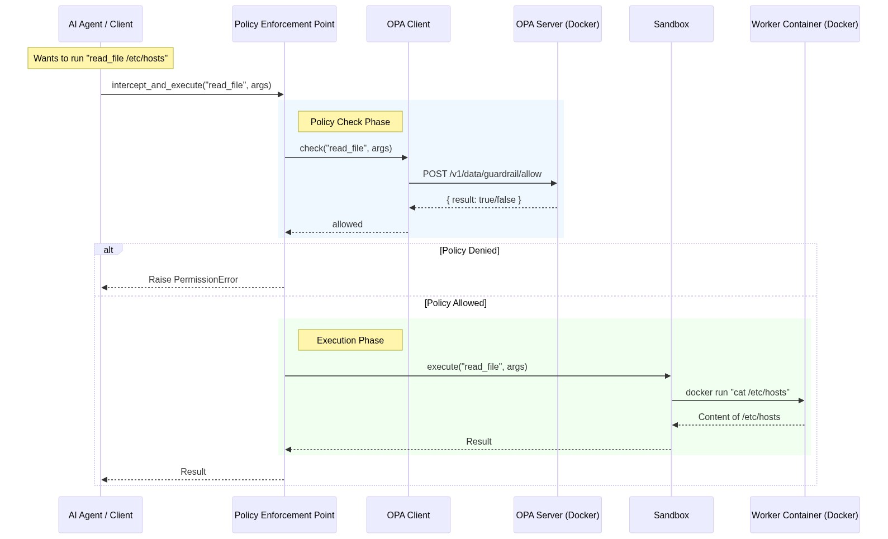

# Agent Guardrail Architecture

This document outlines the architecture of the **Agent Guardrail** system, a security framework designed to act as a **Policy Enforcement Point (PEP)** for AI agents.

## System Overview

The system allows an AI Agent to execute tools (like reading files, listing directories) but enforces strict policies via **Open Policy Agent (OPA)** before any action is executed. Allowed actions are run within a secure **Docker Sandbox** to prevent harm to the host.

### Key Components

1.  **AI Agent / Client**: The initiator of the action. It attempts to call tools to perform tasks.
2.  **Policy Enforcement Point (PEP)**: The central component that intercepts all tool calls. It is responsible for:
    *   Asking OPA if the action is allowed.
    *   Executing the action in the Sandbox if allowed.
    *   Blocking the action if denied.
3.  **OPA Client**: A helper class that handles HTTP communication with the OPA server.
4.  **OPA Manager**: Manages the lifecycle (start/stop) of the OPA Server container.
5.  **OPA Server (Docker)**: A Docker container running the Open Policy Agent. It loads policies from the `policy/` directory and evaluates requests.
6.  **Sandbox**: Handles the safe execution of tools. It spins up ephemeral Docker containers to run commands in isolation.
7.  **Worker Container (Docker)**: An isolated container (e.g., `python:3.9-slim`) where the actual shell commands (`ls`, `cat`, `rm`) are executed.

## Architecture Diagram

The following diagram illustrates the flow of a tool execution request:

## Component Interactions

### 1. Initialization
When the system starts (e.g., via `run_demo.py`):
- `OPAManager.ensure_running()` is called.
- It checks if the `opa-guardrail` container is running.
- If not, it starts an OPA container, mounting the local `policy/` directory to `/policy` inside the container.

### 2. Policy Enforcement
- The `PEP` receives a tool name and arguments.
- It delegates the decision to `OPAClient`.
- `OPAClient` queries `http://localhost:8181/v1/data/guardrail/allow` with the input data.
- The OPA server evaluates the Rego policies defined in `policy/main.rego`.

### 3. Sandboxed Execution
- If the policy allows the action, `PEP` calls `Sandbox.execute()`.
- The `Sandbox` implementation uses the `docker` python SDK.
- It translates the abstract tool call (e.g., `read_file`) into a shell command (e.g., `cat ...`).
- It runs a temporary Docker container (`python:3.9-slim`) to execute this command.
- `network_disabled=True` is set for isolation (unless otherwise configured).
- The container is removed immediately after execution.

## Directory Structure & Responsibilities

| Directory/File | Responsibility |
| :--- | :--- |
| `guardrail/pep.py` | Main entry point; orchestrates policy check and execution. |
| `guardrail/opa_client.py` | Handles HTTP requests to the OPA server. |
| `guardrail/opa_manager.py` | Manages OPA container lifecycle (start/stop). |
| `guardrail/sandbox.py` | Abstraction for Docker execution; isolates tool effects. |
| `policy/main.rego` | Defines the actual allowable actions (Rego code). |
| `run_demo.py` | Example script demonstrating the flow. |
